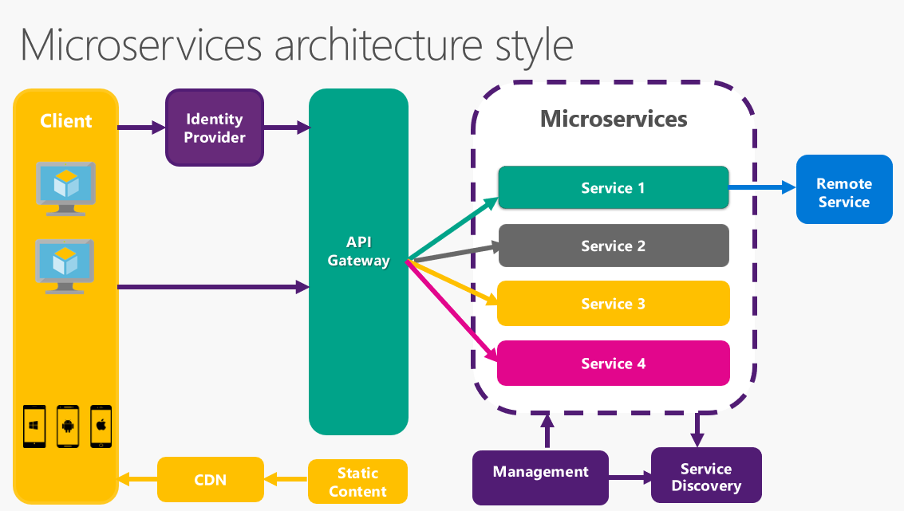
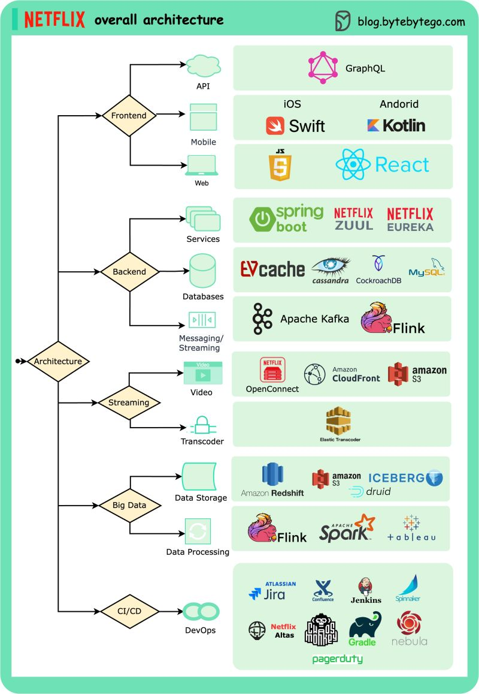

# Step-by-Step Guide to Spring Boot Microservices with Okta Security

This guide walks you through building a microservices architecture using Spring Boot, incorporating REST APIs, services, service registry, API gateway, GitHub configuration, and securing the microservices with Okta for JWT OAuth authentication.

## Step 1: Setting Up Your Environment

- Install Java Development Kit (JDK): Ensure JDK 8 or later is installed.
- Install an IDE: Use IntelliJ IDEA or Eclipse.
- Install Maven: Maven is used for dependency management.

## Step 2: Creating a REST API

- Project Setup: Create a new Spring Boot project using Spring Initializr.
- Define REST Controller: Use `@RestController` and `@RequestMapping` annotations to define REST endpoints.
- Implement CRUD Operations: Create endpoints for Create, Read, Update, and Delete operations.

## Step 3: Implementing Services

- Define Service Layer: Use `@Service` annotation to define service classes.
- Business Logic: Implement business logic in service classes.

## Step 4: Implementing Service Registry

- Add Eureka Server Dependency: Include `spring-cloud-starter-netflix-eureka-server` in your pom.xml.
- Configure Eureka Server: Use `@EnableEurekaServer` annotation to enable Eureka server functionality.
- Register Services: Services automatically register themselves with Eureka server.

## Step 5: Implementing API Gateway

- Add Zuul Dependency: Include `spring-cloud-starter-netflix-zuul` in your pom.xml.
- Configure Zuul: Use `@EnableZuulProxy` annotation to enable Zuul proxy functionality.
- Route Configuration: Define routes to direct requests to appropriate microservices.

## Step 6: GitHub Configuration

- Create GitHub Repository: Set up a GitHub repository for your microservices project.
- Configure Version Control: Initialize Git in your project directory and connect it to your GitHub repository.
- Push Code to GitHub: Push your codebase to the GitHub repository.

## Step 7: Securing with Okta JWT OAuth

- Add Okta Dependency: Include Okta dependencies in your pom.xml.
- Configure Okta: Set up Okta developer account and configure OAuth 2.0 application.
- Implement Security Config: Use Spring Security and Okta integration for JWT OAuth authentication.

## Step 8: Next Steps

- Testing and Validation: Test your microservices and APIs thoroughly.
- Documentation: Document your APIs using Swagger or OpenAPI.
- Monitoring and Scaling: Implement monitoring tools and consider scaling options based on demand.

## Conclusion

You've successfully built a microservices architecture using Spring Boot, incorporating REST APIs, services, service registry, API gateway, GitHub configuration, and securing with Okta for JWT OAuth authentication. Continue exploring advanced features, performance optimization, and scalability as you evolve your microservices ecosystem.
#### NETFLIX FLOW

#### ARCHITECHTURE 
#### FRONTEND - BACKEND

